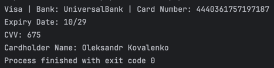
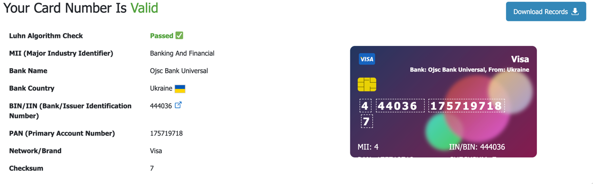

## Документація по коду PHP для генерації інформації про банківську карту
### 0. **Запуск**


Для запуску потрібно лише встановити потрібну версію PHP і запустити:

```bash
php card.php
```

### 1. **Функціонал коду**

Цей PHP-скрипт виконує генерацію випадкових даних для банківської карти. Він виводить наступну інформацію:
- Тип карти (Visa або MasterCard)
- Банк, якому належить карта
- Випадково згенерований номер карти
- Дата закінчення строку дії карти
- CVV-код карти
- Ім'я та прізвище власника карти

Довжина коду 816 символів, включаючи <?php, все в одній стрічці в функції виводу echo.

### 2. **Приклад виводу**

Приклад виводу згенерованої карти:

```plaintext
MasterCard | Bank: Monobank | Card Number: 5375419796615696
Expiry Date: 08/25
CVV: 260
Cardholder Name: Mykola Bondar
```

### 3. **Пояснення логіки роботи**

##### 3.1 Генерація типу карти та банку

Список BIN-кодів українських банків (неповний і скорочений):
- `PrivatBank` - 473118
- `UniversalBank` - 444036
- `RaiffeisenBank` - 512070
- `OschadBank` - 516749
- `Monobank` - 537541, 444111

Функція `array_rand()` випадковим чином вибирає банк і один з його BIN-кодів.

Далі функція `str_starts_with()` перевіряє, чи починається номер карти (BIN) з цифри 4. Якщо так, це карта Visa; якщо ні, то MasterCard.

#### 3.2 Генерація номера карти

Номер карти складається з:
- Перші 6 цифр — це BIN-код банку.
- Наступні 9 цифр — випадково згенеровані числа.
- Остання цифра — контрольна цифра, обчислена за алгоритмом Луна.

#### 3.3 Генерація дати закінчення

Скрипт використовує функцію `rand()` для випадкової генерації місяця (від 1 до 12) та року (поточний рік + 1 до 5 років вперед). Місяць форматують до двох цифр за допомогою функції `str_pad()`.

#### 3.4 Генерація CVV

CVV код карти створюється за допомогою функції `rand(100, 999)`, яка генерує випадкове число від 100 до 999.

#### 3.5 Генерація імені власника карти

Скрипт випадково вибирає ім'я та прізвище з двох масивів із фіксованими значеннями:
- Імена: `['Andriy', 'Oksana', 'Oleksandr', 'Iryna', 'Mykola', 'Svitlana']`
- Прізвища: `['Shevchenko', 'Ivanenko', 'Kovalenko', 'Bondar', 'Tkachenko']`

#### 3.6 Генерація контрольної цифри за алгоритмом Луна

Для обчислення останньої цифри номера карти (контрольної) використовується **алгоритм Луна**.

### 4. **Алгоритм Луна**

Алгоритм Луна — це простий спосіб перевірити правильність номера картки або іншого довгого числа, наприклад, IMEI. Він допомагає знаходити помилки, які можуть виникнути при випадковому введенні неправильної цифри. Алгоритм не захищає від підробок, але легко виявляє прості помилки.

```php
<?php
function checkLuhn($number) {
    $number = strval($number);  // Перетворюємо номер у рядок
    $sum = 0;
    $nDigits = strlen($number);
    $parity = $nDigits % 2;  // Визначаємо парність

    for ($i = 0; $i < $nDigits; $i++) {
        $digit = intval($number[$i]);

        if ($i % 2 == $parity) {  // Множимо кожну другу цифру на 2
            $digit *= 2;
            if ($digit > 9) {
                $digit -= 9;  // Віднімаємо 9, якщо більше 9
            }
        }

        $sum += $digit;  // Складаємо цифри
    }

    return ($sum % 10) === 0;  // Перевіряємо подільність на 10
}

// Приклад використання
$cardNumber = "4561261212345467";
if (checkLuhn($cardNumber)) {
    echo "Номер картки вірний.";
} else {
    echo "Номер картки невірний.";
}
?>
```

### 5. **Будова номера банківської карти**

Стандартний номер банківської карти зазвичай складається з 16 цифр і включає:
1. **BIN (Bank Identification Number)** — перші 6 цифр, що ідентифікують банк-емітент.
2. **Персональний номер рахунку** — наступні 9 цифр, що унікально ідентифікують рахунок власника карти в банку.
3. **Контрольна цифра** — остання цифра, розрахована з використанням алгоритму Луна для перевірки правильності номера карти.

### 6. **Перевірка результатів роботи**

Запускаємо скрипт і отримуємо наступну інформацію:



Далі за допомогою сервісу [dnschecker.org](https://dnschecker.org/credit-card-validator.php?ccn=4440361757197187) перевіряємо валідність нашої карти:



Як ми можемо бачити, сайт успішно визначив країну згенерованої карти та банк, також підтвердив, що алгоритм Луна працює без помилок.

